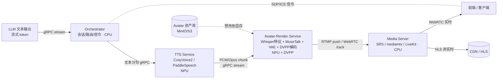
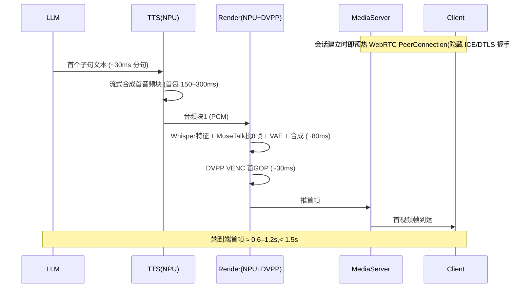

# 基于昇腾 910B 的 2D 实时对话数字人后端推理与渲染方案

> **范围**:仅覆盖 LLM 生成文本回复**之后**的链路——`LLM 文本输出 → TTS 语音合成 → 2D 唇形同步渲染 → 实时视频流输出`。
> **硬件**:单卡 / 多卡昇腾 910B(Atlas 800/900 系列),充分利用 NPU 算力与 DVPP 媒体硬加速。
> **目标**:端到端首帧延迟 < 1.5s,准实时对话体验;全链路容器化部署;形象可热换、支持多语种、预留 3D 接口。

---

## 目录

1. [关键架构判断与两点纠偏](#一关键架构判断与两点纠偏)
2. [总体架构](#二总体架构)
3. [技术选型](#三技术选型)
4. [昇腾 910B NPU 适配](#四昇腾-910b-npu-适配)
5. [管线架构与通信](#五管线架构与通信)
6. [各模块详细设计](#六各模块详细设计)
7. [容器化设计](#七容器化设计)
8. [性能与并发](#八性能与并发)
9. [可扩展性](#九可扩展性)
10. [可落地配置示例](#十可落地配置示例)
11. [落地前的验证清单与待确认参数](#十一落地前的验证清单与待确认参数)

---

## 一、关键架构判断与两点纠偏

### 1.1 核心架构判断:底板循环视频 + 嘴部区域实时重绘

本方案场景为人物站立、无大肢体动作、核心只要高精度唇形。这正好让我们**不必逐帧生成整张画面**,而采用量产 2D 数字人的通用套路:

- **注册阶段(每个形象一次)**:预渲染一段该人物的"静默待机循环"视频(自然眨眼、轻微呼吸/晃动,首尾对接成无缝 loop,约 10–30s),并离线算好每一帧的人脸检测框、mask、关键点,以及(MuseTalk 路线下)VAE 编码后的潜变量,全部缓存进 NPU 显存,形成"形象资产包"。
- **运行阶段(每次对话)**:底板 loop 持续播放作为载体;TTS 流式产出音频;每个输出帧只做"音频特征 + 嘴部潜变量重绘 + VAE 解嘴部小块 + 合成 + 编码"。因为底板帧及其潜变量已预缓存,**单帧 NPU 计算量极小**。

这是 MuseTalk 实时 demo、Heygem、Linly-Talker 等量产数字人的共同做法,也是能在单卡 910B 上跑出准实时、且形象可热换的根本原因。

### 1.2 对原始诉求的两点纠偏

1. **FunASR 是语音识别(ASR)框架,不是 TTS**。阿里 FunAudioLLM 体系里对应 TTS 的是 **CosyVoice**,本方案按 CosyVoice 选型。
2. **HLS / LL-HLS 天生满足不了 1.5s 首帧**(LL-HLS 实测也在 2–4s)。因此对话主链路必须走 **WebRTC**;RTMP 用作内部推流/接入;HLS 仅用于对实时性不敏感的大规模分发。

---

## 二、总体架构

### 2.1 运行时数据流



### 2.2 首帧时延流水线(说明 1.5s 如何达成)



### 2.3 一个反直觉但重要的服务边界取舍

**LipSync、合成、编码三件事建议合并在同一个进程(Avatar-Render Service)里,不要拆成三个微服务。**

原因:像素流太大——720p NV12 一帧约 1.3MB,25fps 单路就是 ~33MB/s,这种数据走 gRPC 跨 Pod 会同时吃掉带宽和时延,还逼着你在网络上反复做 H2D/D2H 拷贝。音频流(几十 KB/s)才适合跨服务传。**服务边界应按"数据量 + 是否驻留同一块 NPU"来切,而不是按功能机械四等分。**

---

## 三、技术选型

### 3.1 TTS 引擎

| 选项 | 流式 | 首包延迟 | 多语种/克隆 | 昇腾适配难度 | 定位 |
|---|---|---|---|---|---|
| **CosyVoice 2**(FunAudioLLM) | 原生支持 | ~150ms | 强(zh/en/ja/ko,零样本克隆) | 中(PyTorch→torch_npu / 部分模块 ONNX→OM) | **首选**,满足"多语种+自定义音色" |
| **PaddleSpeech**(FastSpeech2+HiFiGAN) | 支持 | 低 | 中 | **低**(PaddlePaddle 有官方昇腾后端 PaddleCustomDevice) | 国产化/落地最稳的备选 |
| Kokoro / MeloTTS | 部分 | 极低 | 中 | 低 | 不需克隆、追求极致轻量时 |

**推荐 CosyVoice 2 为主、PaddleSpeech 为备**。CosyVoice 表现力和克隆最好但为 PyTorch,适配工作量集中在其自回归 token 模型上;PaddleSpeech 因 Paddle 有官方昇腾后端,适合最快跑通、最少踩坑,可先用它打通链路再切 CosyVoice。

### 3.2 唇形同步算法

| 模型 | 原理 | 实时性 | 换形象成本 | 画质 | 本方案定位 |
|---|---|---|---|---|---|
| **MuseTalk v1.5** | 潜空间嘴部 inpainting,Whisper 音频特征驱动,256×256 | 30fps+ /卡 | 低(免训练即可用,微调更佳) | 高 | **首选**,高精度+可热换 |
| **Wav2Lip(+GFPGAN)** | 直接像素生成 + 唇形判别器 | 极快 | 极低 | 中(原生偏软,需超分增强) | 低延迟/弱硬件**兜底档** |
| GeneFace++ / ER-NeRF | NeRF 逐人训练 | 中 | **高**(每个形象都要训练视频) | 高 | 与"可热换"冲突,不采用 |
| SadTalker / Hallo / EchoMimic / Sonic | 扩散类 talking head | 秒级 | 中 | 极高 | 太慢,且无大动作不需要,不采用 |

**推荐 MuseTalk 为主,Wav2Lip 为兜底档**。NeRF 类逐人训练直接否掉"形象热切换";扩散类质量虽高但秒级延迟,站立无动作场景属杀鸡用牛刀。两条路都套用 §1.1 的"底板 loop + 嘴部重绘"模式。

> **重要特性**:唇形模型由音频驱动,与语种无关,因此多语种在唇形侧天然零成本。

### 3.3 渲染与编解码

- **合成**:on-NPU / DVPP 的羽化 alpha 贴回——把重绘的嘴部 patch 用 feather mask 融回底板,边界做 crossfade 防跳变。
- **视频编码**:用 **DVPP 硬编(VENC,H.264/H.265)** 而非 CPU x264,避免 CPU 成为瓶颈。
- **推流/分发**:用 **SRS**(单组件同时支持 RTMP 接入 + WebRTC + HLS 出流,最省事)或 **mediamtx**(更轻)/ **LiveKit**(大规模 WebRTC SFU)。FFmpeg 仅在需要复杂封装时使用。

---

## 四、昇腾 910B NPU 适配

### 4.1 模型转换路线

不要一刀切全转 OM。**自回归循环类用 torch_npu,固定形状的热路径模型转 OM**:

| 模块 | 原始框架 | 适配路线 | 理由 |
|---|---|---|---|
| CosyVoice 文本→token(自回归) | PyTorch | **torch_npu**(或 MindIE-LLM) | AR 循环 + 动态长度,OM 不友好 |
| CosyVoice flow-matching / 声码器 | PyTorch | **ONNX→OM(ATC)** | 形状稳定,要极致吞吐 |
| FastSpeech2(PaddleSpeech) | Paddle | PaddleCustomDevice 或 ONNX→OM | Paddle 有官方昇腾后端 |
| Whisper Encoder(音频特征) | PyTorch | **ONNX→OM** | 固定 encoder,热路径 |
| MuseTalk U-Net | PyTorch | **ONNX→OM**,256×256 固定 + 动态 batch profile | 单帧热路径,核心算力点 |
| VAE Encoder/Decoder | PyTorch | **ONNX→OM** | 注册期编码 + 运行期解码 |
| Wav2Lip 生成器 / GFPGAN(如启用) | PyTorch | **ONNX→OM** | 兜底档热路径 |

ATC 转换示例:

```bash
atc --model=musetalk_unet.onnx \
    --framework=5 \
    --output=musetalk_unet \
    --soc_version=Ascend910B \
    --input_shape="latent:-1,8,32,32;audio_feat:-1,50,384" \
    --dynamic_batch_size="4,8,12,16" \
    --precision_mode=allow_fp16 \
    --op_select_implmode=high_performance
```

### 4.2 DVPP / ACL / CANN 落地要点

- **DVPP 全程吃下媒体路径,像素不下卡**:VDEC 解底板视频帧(若存为 H.264)、VPC 做缩放/裁剪/色域转换(NV12↔RGB,模型要 RGB、编码要 NV12)、VENC 硬编输出。配合 ACL 异步 memcpy + 多 stream 流水。
- **Avatar 资产驻留 HBM**:把底板帧的潜变量 / mask / 关键点常驻显存,运行时每帧禁止整帧 H2D——这是延迟和吞吐的命门。
- **算子覆盖率是真正的坑**:MuseTalk / CosyVoice 中某些 `grid_sample`、特定 interpolation、自定义 attention 可能不支持或回落到 AICPU 导致变慢。落地必须做一遍 **msprof 性能剖析**,定位 AICPU 回退算子,改写或用 Ascend C / TBE 写自定义核。**这一步通常占整个移植约 60% 的工作量,排期需留足。**
- **精度**:910B 原生 FP16;U-Net / 声码器可进一步用 **MSModelSlim / AMCT** 做 INT8 量化压延迟,但要盯住嘴部画质回归。
- **图融合**:OM 转换期由 GE 自动算子融合;torch_npu 路线用 TorchAir 图模式 + AOE 自动调优减少 kernel launch。

---

## 五、管线架构与通信

### 5.1 通信分面

- **控制面(文本/信令)**:gRPC 双向流或 WebSocket;LLM → Orchestrator → TTS 走 gRPC server-streaming。
- **音频面(TTS→Render)**:gRPC 双向流传 PCM/Opus 小块;同节点可用共享内存 ring buffer 进一步降延迟。
- **像素面**:进程内共享设备内存,**绝不上网络**。
- **热路径上不放 Kafka/RabbitMQ**——只在离线异步任务(日志、埋点、形象注册批处理)使用消息队列。

### 5.2 流式策略(1.5s 的核心来源)

1. **LLM 文本按子句/标点切块**,子句 1 进 TTS 时 LLM 还在生成子句 2,全程流水。
2. **TTS 流式出音频子块**(CosyVoice 首包 150–300ms)。
3. **唇形按音频窗口分帧批处理**:每次 NPU 前向处理 0.2–0.5s(5–12 帧)音频窗口,一批算完立即吐帧。
4. **小 look-ahead 缓冲**覆盖模型感受野,块边界做嘴部 crossfade 防伪影。
5. **A/V 同步**:音频帧与视频帧打同一时钟 PTS,Render 端按 PTS 封装。
6. **背压**:下游慢就降级回底板待机帧(闭嘴/idle)并重新对齐,**永远不阻塞 25fps 截止线**。

---

## 六、各模块详细设计

### 6.1 Avatar-Render Service(进程内多级流水线)

1. 音频入口(gRPC stream)→ PCM ring buffer。
2. Whisper Encoder(OM/NPU)→ 对齐到 25fps 帧网格的音频特征窗。
3. 帧调度器:维护底板 loop 播放头(乒乓索引),逐帧从 HBM 取缓存的(底板潜变量, mask, 关键点)。
4. MuseTalk U-Net(OM/NPU,批 B 帧)条件于(音频窗, 底板潜变量)→ 嘴部潜变量。
5. VAE Decode(OM/NPU)→ 嘴部 RGB 小块。
6. 合成(DVPP/on-NPU):羽化 mask 贴回底板,CSC RGB→NV12。
7. 编码(DVPP VENC,zerolatency,GOP≈fps,B 帧=0)→ 推 RTMP / 喂 WebRTC track。

### 6.2 TTS Service

文本子句入口 → 前端(归一化 / g2p)→ 声学模型(CosyVoice LLM+CFM 或 FastSpeech2,流式)→ 声码器 → 带时间戳吐 PCM/Opus。

### 6.3 Orchestrator(CPU)

会话生命周期、形象/音色选择、**会话粘性路由**(因为形象资产预热在特定 NPU 上,同一会话必须打到同一 Render Pod)、WebRTC 信令(SDP/ICE)端点或 RTMP URL 下发、背压与流控、指标上报。对外暴露拉流 API(返回 WebRTC join token / RTMP play URL / HLS URL)。

---

## 七、容器化设计

### 7.1 基础镜像

用 CANN 官方镜像,如昇腾镜像仓的 PyTorch / MindSpore 镜像(例如 `ascendhub.huawei.com/public-ascendhub/ascend-mindspore`、`ascend-pytorch` 系列),再装 torch_npu / 业务依赖;推理生产用更小的 runtime 镜像。

> **关键约束**:镜像内 CANN toolkit 版本必须与宿主机 driver + firmware 版本匹配(驱动固件在宿主、toolkit 在容器)。

### 7.2 设备挂载

- **单机 / Compose**:用 **Ascend Docker Runtime**(`runtime: ascend` + `ASCEND_VISIBLE_DEVICES`),自动注入 `/dev/davinciX`、`/dev/davinci_manager`、`/dev/devmm_svm`、`/dev/hisi_hdc` 及驱动库。
- **Kubernetes**:用 **Ascend Device Plugin** 把 NPU 暴露为可调度资源。官方 / MindCluster 路线下资源名为 `huawei.com/Ascend910`;若用 **HAMi** 做切分,910B 可按 `huawei.com/Ascend910B` 申请整卡,并用 `huawei.com/Ascend910B-memory` 做显存切片。配 **Volcano** 调度器处理 NPU 拓扑亲和(device-plugin 以 `-volcanoType=true -presetVirtualDevice=true` 启动支持 vNPU)。

> **vNPU 虚拟化是本方案的关键使能项**:910B 可切成模板化的虚拟 NPU(如 `Ascend910-2c-100-1` 形态),从而把 TTS、轻负载服务和 Render 按需打包在一卡上,提高利用率。

### 7.3 服务 → NPU 资源映射

| 服务 | NPU 需求 | 分配建议 |
|---|---|---|
| avatar-render(主算力) | 大 | 独占 1 个 910B die,或大号 vNPU 切片 |
| tts | 中 | vNPU 切片共享,或按负载独占 |
| orchestrator / media-server / signaling | 无 | 纯 CPU |

### 7.4 弹性扩缩

- 水平复制 avatar-render(1 个 vNPU/die 对应 1 组并发流),Orchestrator 做会话→Pod 粘性分配。
- 基于并发会话数 / NPU 利用率(NPU-Exporter + Prometheus + KEDA/HPA)自动扩缩。
- 形象资产用 init/sidecar 预热到 HBM,热切换维护每 Pod 的形象 LRU。

---

## 八、性能与并发

### 8.1 首帧时延预算(WebRTC,预热连接,MuseTalk 档)

| 阶段 | 预算 |
|---|---|
| 文本分句 + 首子句就绪 | 20–50ms |
| 流式 TTS 首音频块(~240ms 音频)产出 | 150–300ms |
| Whisper 特征(NPU) | 20–50ms |
| MuseTalk 首批 8–12 帧 + VAE(NPU) | 30–80ms |
| 合成 + DVPP CSC | 5–15ms |
| DVPP VENC 首 GOP + 封装 | 20–50ms |
| 协议(WebRTC 预热后基本隐藏) | ~0–100ms |
| **合计首帧** | **≈ 0.6–1.2s** ✓ |

### 8.2 吞吐估算(需以实测为准)

单 910B die 跑 MuseTalk 档、底板重绘模式,单帧 NPU 算力很小,真正约束是"25fps 硬截止线下并发几路"。MuseTalk 单路在 V100 级别约 30fps+,910B 的 FP16 算力同级或更高;计入 TTS + VAE 解码 + DVPP 编码争用和截止线余量:

- **单 die 大致可稳定支撑 3–8 路实时**(若把 TTS/编码挪到别处、die 专做唇形,路数更高)。
- **8 卡 Atlas 800 约线性放大到数十路/服务器量级。**

> 这些数字强依赖分辨率(嘴部 256 vs 512)、batch、是否 INT8、单卡共驻服务数,**必须压测验证,不能直接当容量承诺**。

### 8.3 延迟瓶颈排查清单

1. WebRTC ICE/DTLS 握手 → 会话建立即预热。
2. TTS 首包 → 用流式 TTS。
3. AICPU 算子回退 → msprof 定位并改写。
4. H2D/D2H 拷贝 → 像素留卡、资产驻留 HBM。
5. 编码 GOP/关键帧间隔 → 小 GOP 加速首帧。
6. 块边界 look-ahead → 引入固定时延,需权衡画质与延迟。

### 8.4 多卡扩展

Volcano gang scheduling 保证一个会话需要的 tts + render 共调度;跨卡按"一卡一组流"水平铺开,Orchestrator 负责会话编排,**无单点像素跨卡传输**。

---

## 九、可扩展性

- **多形象热切换**:形象 = 一个资产包(底板 loop 帧 + 缓存潜变量/mask/关键点 + 可选微调 U-Net 权重),存对象存储,LRU 预热进 HBM,切换即换激活指针、后台预热新形象。配套一条**离线形象注册流水线**(K8s Job/CronJob):新人物视频 → 产出资产包。
- **多语种 TTS**:CosyVoice 多语种,按声明/检测语种路由到对应音色模型,每个(形象, 语种)维护音色 embedding;唇形侧因音频驱动天然语种无关。
- **3D 数字人预留**:把接口抽象成"音频(或 viseme/blendshape + 表情参数)→ 帧",定义一个 **ARKit 风格 viseme/blendshape 中间表示**:TTS/音频 → viseme/表情流 → 渲染器。2D 渲染器经唇形模型消费它;未来 3D 渲染器(UE MetaHuman / Audio2Face / 3DGS 高斯泼溅 avatar)消费同一份流。**渲染器藏在稳定的 gRPC 契约后面整体替换,2D→3D 不动上游。**

---

## 十、可落地配置示例

> 以下镜像 tag、CANN 版本、`accelerator` 标签、vNPU 模板均需按实际集群替换。

### 10.1 Dockerfile(avatar-render,示意)

```dockerfile
# 版本请对齐你集群宿主机的 driver/firmware
FROM ascendhub.huawei.com/public-ascendhub/ascend-pytorch:8.0-ubuntu22.04

ENV LD_LIBRARY_PATH=/usr/local/Ascend/ascend-toolkit/latest/lib64:$LD_LIBRARY_PATH \
    ASCEND_TOOLKIT_HOME=/usr/local/Ascend/ascend-toolkit/latest

WORKDIR /app
COPY requirements.txt .
RUN pip install --no-cache-dir -r requirements.txt   # torch_npu, opencv, grpcio, soundfile, av...
COPY ./service /app/service
COPY ./models  /app/models                            # *.om (musetalk/vae/whisper), 资产 manifest
EXPOSE 50051 1935
CMD ["python", "-m", "service.render_server"]
```

### 10.2 docker-compose.yml(单机开发/验证)

```yaml
version: "3.9"
services:
  orchestrator:
    image: registry.local/dh/orchestrator:0.1
    ports: ["8080:8080", "50050:50050"]   # 拉流API / 信令
    depends_on: [tts, avatar-render]

  tts:
    image: registry.local/dh/tts:0.1
    runtime: ascend                         # 需在 /etc/docker/daemon.json 配 ascend-docker-runtime
    environment:
      - ASCEND_VISIBLE_DEVICES=0            # 与 render 共卡(vNPU)或换成 1 独占
      - TTS_BACKEND=cosyvoice2
    expose: ["50052"]

  avatar-render:
    image: registry.local/dh/avatar-render:0.1
    runtime: ascend
    environment:
      - ASCEND_VISIBLE_DEVICES=0
      - LIPSYNC_BACKEND=musetalk
      - ASSET_BUCKET=s3://avatars
    expose: ["50051"]
    # 若未启用 ascend-docker-runtime,改用手动挂载:
    # devices: ["/dev/davinci0","/dev/davinci_manager","/dev/devmm_svm","/dev/hisi_hdc"]
    # volumes:
    #   - /usr/local/Ascend/driver:/usr/local/Ascend/driver:ro
    #   - /usr/local/dcmi:/usr/local/dcmi:ro
    #   - /usr/local/bin/npu-smi:/usr/local/bin/npu-smi:ro

  media-server:
    image: ossrs/srs:5                       # RTMP 接入 + WebRTC + HLS 出流
    ports: ["1935:1935", "8000:8000/udp", "8088:8080"]

  minio:
    image: minio/minio
    command: server /data --console-address ":9001"
    ports: ["9000:9000", "9001:9001"]
```

### 10.3 Kubernetes(生产,Ascend Device Plugin + Volcano)

```yaml
apiVersion: apps/v1
kind: Deployment
metadata:
  name: avatar-render
spec:
  replicas: 4
  selector: { matchLabels: { app: avatar-render } }
  template:
    metadata: { labels: { app: avatar-render } }
    spec:
      schedulerName: volcano              # NPU 拓扑亲和调度
      nodeSelector:
        accelerator: huawei-Ascend910     # NPU 节点标签
      containers:
        - name: avatar-render
          image: registry.local/dh/avatar-render:0.1
          env:
            - { name: LIPSYNC_BACKEND, value: "musetalk" }
            - { name: ASSET_BUCKET,    value: "s3://avatars" }
          ports:
            - { containerPort: 50051 }
            - { containerPort: 1935 }
          resources:
            limits:
              huawei.com/Ascend910: 1     # 整卡;HAMi 切分则用 huawei.com/Ascend910B + -memory
              cpu: "8"
              memory: 24Gi
          # 默认 ascend-docker-runtime 自动注入驱动设备,无需手动挂载
---
apiVersion: v1
kind: Service
metadata: { name: avatar-render }
spec:
  selector: { app: avatar-render }
  ports:
    - { name: grpc, port: 50051, targetPort: 50051 }
    - { name: rtmp, port: 1935,  targetPort: 1935 }
---
apiVersion: apps/v1
kind: Deployment
metadata: { name: tts }
spec:
  replicas: 2
  selector: { matchLabels: { app: tts } }
  template:
    metadata: { labels: { app: tts } }
    spec:
      schedulerName: volcano
      nodeSelector: { accelerator: huawei-Ascend910 }
      containers:
        - name: tts
          image: registry.local/dh/tts:0.1
          env: [ { name: TTS_BACKEND, value: "cosyvoice2" } ]
          ports: [ { containerPort: 50052 } ]
          resources:
            limits:
              huawei.com/Ascend910B: 1           # HAMi 切分:tts 走 vNPU 共卡
              huawei.com/Ascend910B-memory: 8192 # 申请 8GB 显存切片
              cpu: "4"
              memory: 12Gi
---
apiVersion: apps/v1
kind: Deployment
metadata: { name: orchestrator }      # 纯 CPU,不申请 NPU
spec:
  replicas: 2
  selector: { matchLabels: { app: orchestrator } }
  template:
    metadata: { labels: { app: orchestrator } }
    spec:
      containers:
        - name: orchestrator
          image: registry.local/dh/orchestrator:0.1
          ports: [ { containerPort: 8080 }, { containerPort: 50050 } ]
          resources: { limits: { cpu: "2", memory: 4Gi } }
---
apiVersion: autoscaling/v2
kind: HorizontalPodAutoscaler
metadata: { name: avatar-render-hpa }
spec:
  scaleTargetRef: { apiVersion: apps/v1, kind: Deployment, name: avatar-render }
  minReplicas: 4
  maxReplicas: 32
  metrics:
    - type: Pods
      pods:
        metric: { name: active_sessions }   # 由 NPU-Exporter/自定义指标提供
        target: { type: AverageValue, averageValue: "4" }   # 单 Pod 目标并发,压测后校准
```

部署 Ascend Device Plugin 与 Volcano(其余 RBAC / ConfigMap 略):

```bash
kubectl label node <npu-node> accelerator=huawei-Ascend910
kubectl apply -f https://raw.githubusercontent.com/Project-HAMi/ascend-device-plugin/refs/heads/main/ascend-device-plugin.yaml
# Volcano 按官方 release 安装
```

---

## 十一、落地前的验证清单与待确认参数

### 11.1 最该先验证的三件事

1. **算子覆盖率**:先把 MuseTalk + CosyVoice 跑通 torch_npu,用 msprof 抓 AICPU 回退,评估改写工作量——这决定整体排期。
2. **首帧实测**:搭最小链路(预热 WebRTC + 流式 TTS + 8 帧批),实测首帧是否真在 1.5s 内,定位最大那一段。
3. **单卡并发压测**:固定分辨率和 batch,逐步加并发流直到掉帧,得出真实的单 die 路数,再反推容量规划。

### 11.2 影响吞吐/切分方案的待确认参数

- **目标分辨率**:嘴部 256 还是要 512+/高清?(直接决定单卡路数与是否需要超分)
- **单服务器卡数**:决定总并发与多卡扩展拓扑。
- **优先级取向**:优先"压更低延迟"还是"堆更高并发"?(影响 batch 大小、look-ahead、是否 INT8、vNPU 切分粒度)

---

*本文档版本号、CANN/驱动版本、镜像 tag 等请在实施时按目标集群实际环境锁定。*
